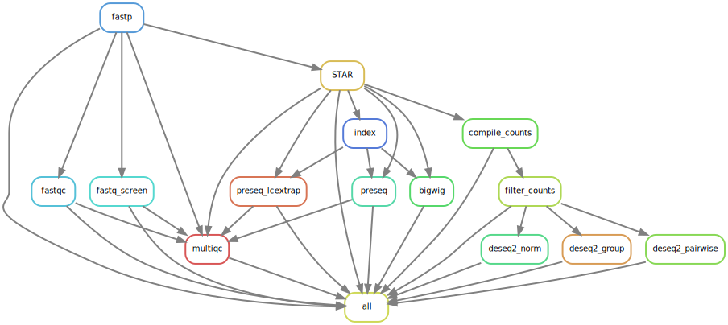

# rna_seq

[](https://svgshare.com/i/Zhy.svg)
[](https://shields.io/)


This SnakeMake pipeline processes aligns bulk RNA-Seq datasets using STAR and finds differential gene expression between conditions using DESeq2. 

## 1. Prepare you work environment

```bash
# create a new working directory and clone this repository
mkdir my_project
cd my_project
git clone https://github.com/maxsonBraunLab/rna_seq.git
cd rna_seq

# create a folder to symlink files into
mkdir -p data/raw
ln -s /absolute/path/to/files/EXP0000001_sample_R1_S001.fastq.gz
ln -s /absolute/path/to/files/EXP0000001_sample_R2_S001.fastq.gz
...

# rename symlinks to remove extraneous strings and match the following format:  {sample}_{R1|R2}.fastq.gz
mv EXP0000001_sample_R1_S001.fastq.gz sample_R1.fastq.gz
mv EXP0000001_sample_R2_S001.fastq.gz sample_R2.fastq.gz
```

Please double check your samples are in the following format before moving forward: `{sample}_{R1|R2}.fastq.gz`i

## 2. Prepare your conda environment(s)

This pipeline relies on [anaconda](https://www.anaconda.com/) to create reproducible environments. To run the pipeline, we need a separate anaconda environment with a clean install of SnakeMake - this environment will be used to invoke other SnakeMake pipelines, so we only need to install it once. The following code chunk assumes you have [mamba](https://github.com/mamba-org/mamba) installed.

```bash
# create an env with only snakemake inside of it
mamba create -n snakemake -c bioconda -c conda-forge snakemake

# while in the working directory, create all the environments required in the pipeline.
# specifically save them to this prefix folder so we only install everything once.
conda_prefix="${CONDA_PREFIX_1}/envs"

snakemake -j 1 --use-conda --conda-prefix $conda_prefix --conda-create-envs-only
```

## 3. Prepare your pipeline configurations

To tailor the analysis to your needs, there are a series of files to edit before running the pipeline. 

1. `config.yaml`
   1. This file specifies which STAR genomes to align to, feature biotypes to select (e.g. protein coding genes), and differential analysis schemes. 
2. `config/metadata.txt`
   1. This is a REQUIRED 2-column table (tab-separated format, no header) containing pairwise combinations to assess. The order of conditions matter (column1-vs-column2) to facilitate biological interpretation. 
3. `config/groups.txt`
   1. An OPTIONAL 1-column table containing all the conditions used for group DESeq2 analysis. The order of conditions affect the plot order in the output heatmap. By default, use all the conditions in the metadata.
4. `config/replicates.yaml`
   1. An OPTIONAL YAML file that shows how to collapse biological replicates for DESeq2 group analysis (mainly affects the heatmap). Ignored if MERGE_REPLICATES is False.

## 4. Run the pipeline

### Local execution

You can run the pipeline using an interactive node like this:

```bash
srun --cores=20 --mem=64G --time=24:00:00 --pty bash
conda activate snakemake
snakemake -j <n cores> --use-conda
```

This is sufficient for small jobs or running small parts of the pipeline, but not appropriate for the entire process.

### SLURM execution

To run the pipeline using batch mode use the following command:

```bash
snakemake -j 64 \
	--use-conda \
	--conda-prefix $conda_prefix \
	--cluster-config cluster.yaml \
	--profile slurm 
```

This will allow SnakeMake to submit up to 64 jobs at once. The conda environments will be drawn from the $conda_prefix folder.  SLURM execution is appropriate for running many computationally-intensive programs (e.g. read alignment).

## Reproducible results with SnakeMake + Singularity

To ensure the reproducibility of your results, we  recommend running a SnakeMake workflow using Singularity containers.  These containers standardize the underlying operating system of the  workflow (e.g. Ubuntu, centOS, etc.), while conda tracks the  installation of bioinformatic software (e.g. bowtie2, samtools, deseq2). To utilize Singularity in your analysis, log in to an interactive node  and load the module first like this:

```bash
# request an interactive node
srun -p light --time=36:00:00 --pty bash

# re-activate your environment with snakemake
conda activate <snakemake-env>

# load the singularity program
module load /etc/modulefiles/singularity/current
```

More Singularity documentation on Exacloud can be found [here](https://wiki.ohsu.edu/display/ACC/Exacloud%3A+Singularity). If it is your first time running the pipeline, and especially when  using Singularity, we must install all the conda environments using the  following command:

```bash
indices_folder="/home/groups/MaxsonLab/indices"
conda_folder="${CONDA_PREFIX_1}/envs"
fastq_folder="/home/groups/MaxsonLab/input-data2/path/to/FASTQ/folder/"

snakemake -j 1 \
	--verbose \
	--use-conda \
	--conda-prefix $conda_folder \
	--use-singularity \
	--singularity-args "--bind $indices_folder,$conda_folder,$fastq_folder" \
	--conda-create-envs-only
```

The above code snippet will take about an hour or more to  set up, but is a one-time installation. After creating the conda  environments and configuring the pipeline, we can invoke the pipeline in the same shell like this:

```bash
# Singularity + interactive run
snakemake -j <n cores> \
	--use-conda \
	--conda-prefix $conda_folder \
	--use-singularity \
	--singularity-args "--bind $indices_folder,$conda_folder,$fastq_folder"

# Singularity + slurm run
snakemake -j <n jobs> \
	--use-conda \
	--conda-prefix $conda_folder \
	--use-singularity \
	--singularity-args "--bind $indices_folder,$conda_folder,$fastq_folder" \
	--profile slurm \
	--cluster-config cluster.yaml
```

NOTE: make sure to use double quotes and insert an integer for the -j flag.

The above command will install the pipeline's conda environments into the `conda-prefix` directory - this means that conda environments are actually not stored INSIDE the container. The `--bind` argument binds the host (Exacloud) paths to the container to access the genome indices, conda prefix, and the path to the raw sequencing files. The `--profile slurm` will configure default settings for SnakeMake to interact with SLURM - more information can be found [here](https://github.com/maxsonBraunLab/slurm). Feel free to create another [snakemake profile](https://wiki.ohsu.edu/display/ACC/Exacloud%3A+Singularity) that has its own set of singularity arguments for added convenience.

# Output

```
data
├── bigwig			-- genome tracks for each sample
├── counts			-- raw and deseq2-normalized counts tables
├── deseq2			-- group and pairwise analysis of DESeq2 results
├── fastp			-- read trimming results from fastp
├── fastqc			-- FASTQ quality for each sample
├── fastq_screen	-- contamination screen for each sample
├── logs			-- log files for each rule split by sample
├── multiqc			-- multiqc report summarizing QC metrics each sample
├── preseq			-- library complexity for each sample
├── raw				-- raw sequencing reads (symlinks highly recommended)
├── star			-- BAM files for each sample
└── tmp				-- tmp folder for various programs to minimize writing to /tmp in cluster nodes.
```

# Generic Pipeline Structure

```
.
├── cluster.yaml	-- configuration file for SLURM resources
├── config			-- directory for further configuration files
├── config.yaml		-- main config file for the pipeline
├── data			-- contains raw and processed data
├── envs			-- conda environments in YAML format
├── jobs			-- cluster jobs belong here, great for debugging
├── scripts			-- series of scripts used in the pipeline
└── Snakefile		-- core of this SnakeMake pipeline
```

# Methods


